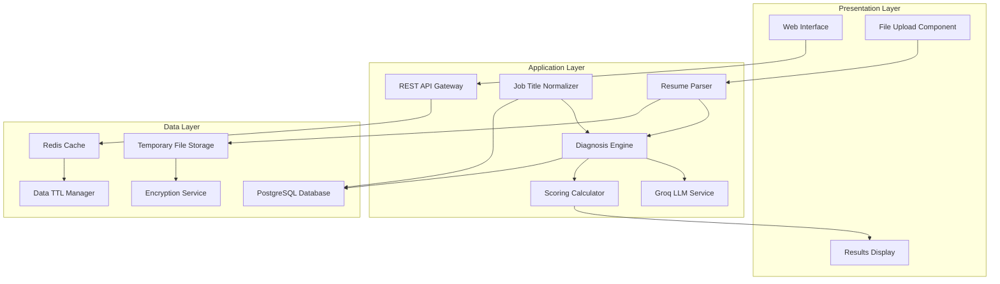
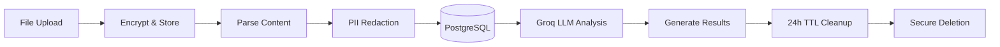

# Design Document: Resume Diagnosis Engine

## Overview

The Resume Diagnosis Engine is an AI-powered web application that analyzes job seekers' resumes against target job requirements to identify specific reasons for interview rejection. The system processes uploaded resumes, performs intelligent job title normalization, conducts multi-dimensional analysis, and delivers prioritized, actionable recommendations with confidence scoring.

The core value proposition is transforming the vague question "Why am I not getting interviews?" into specific, evidence-based answers like "You're missing 'Python' keyword (severity 9/10) and your achievements lack quantification (severity 7/10)."

## Architecture

The system follows a three-tier architecture:



## Components and Interfaces

### Resume Parser Component

**Purpose:** Extract and normalize text content from uploaded resume files

**Interface:**

```typescript
interface ResumeParser {
  parseResume(file: File): Promise<ParsedResume>;
  validateFile(file: File): ValidationResult;
}

interface ParsedResume {
  rawText: string;
  sections: ResumeSection[];
  metadata: DocumentMetadata;
  extractionConfidence: number;
}
```

**Key Responsibilities:**

- Support PDF and DOC/DOCX formats
- Extract structured sections (experience, skills, education)
- Handle various resume formats and layouts
- Provide extraction confidence scoring

### Job Title Normalizer Component

**Purpose:** Convert user-provided job titles into canonical formats using database-stored mappings

**Interface:**

```typescript
interface JobTitleNormalizer {
  normalizeTitle(inputTitle: string): NormalizedTitle;
  suggestTitles(resumeContent: string): string[];
  validateSpecificity(title: string): SpecificityResult;
}

interface NormalizedTitle {
  canonical: string;
  confidence: number;
  alternatives: string[];
  requiresSpecialization: boolean;
}
```

**Implementation:**

- PostgreSQL database with job title mappings and variations
- Embeddings-based similarity for unknown titles using Groq
- Industry-specific role templates stored in database

### Diagnosis Engine Component

**Purpose:** Core AI analysis engine powered by Groq LLM that identifies problems and generates insights

**Interface:**

```typescript
interface DiagnosisEngine {
  analyzeFit(
    resume: ParsedResume,
    targetJob: NormalizedTitle,
    jobDescriptions?: string[],
  ): Promise<DiagnosisResult>;
  identifyGaps(resumeSkills: string[], requiredSkills: string[]): SkillGap[];
  assessATS(resume: ParsedResume): ATSCompatibility;
}

interface DiagnosisResult {
  rootCauses: RootCause[];
  evidence: Evidence[];
  recommendations: Recommendation[];
  overallFitScore: number;
}
```

**Key Responsibilities:**

- Keyword gap analysis (missing critical terms) - **DETERMINISTIC**
- Skills mismatch detection - **DETERMINISTIC**
- Experience level alignment assessment - **MODEL_ASSISTED** (Groq LLM)
- ATS compatibility evaluation - **DETERMINISTIC**
- Achievement quantification analysis - **MODEL_ASSISTED** (Groq LLM)

**Groq Integration:**

- Model-assisted analysis using Groq's fast inference
- Structured prompts for consistent output format
- Temperature settings for deterministic vs creative analysis
- Token limits and cost optimization

**Anti-Hallucination Rules:**

- MUST only cite evidence that exists in parsed resume text or provided job descriptions
- CANNOT invent skills, experience, or achievements not present in source documents
- Model-assisted analysis must reference specific text spans for all claims

### Scoring Calculator Component

**Purpose:** Generate severity, impact, and confidence scores for all findings

**Interface:**

```typescript
interface ScoringCalculator {
  calculateSeverity(problem: Problem, context: AnalysisContext): number;
  calculateImpact(problem: Problem, jobMarket: JobMarketData): number;
  calculateConfidence(analysis: DiagnosisResult, dataQuality: DataQuality): number;
}

interface Problem {
  type: ProblemType;
  description: string;
  evidence: Evidence[];
  affectedSections: string[];
}
```

**Key Responsibilities:**

- Severity scoring (1-10): How much does this reduce interview chances?
- Impact scoring (1-10): How many opportunities does this affect?
- Confidence scoring (0-100): How certain is this diagnosis?
- Evidence quality assessment

### Data Security Architecture

**Database Layer (PostgreSQL):**

- Encrypted at rest with transparent data encryption
- Row-level security for multi-tenant isolation
- Audit logging for all data access and modifications
- Automated backups with encryption

**Encryption Layer:**

- TLS 1.3 for all data transmission
- AES-256 encryption for temporary file storage
- Encrypted memory buffers during processing

**Anonymization Pipeline:**

- PII redaction: names, addresses, phone numbers, emails
- Identifier replacement: consistent tokens for analysis
- Skill/experience preservation for diagnostic accuracy

**Data Lifecycle Management:**

- TTL-based automatic deletion (24-hour maximum)
- Database triggers for automated cleanup
- Secure deletion with overwrite verification



## Scoring Rubric

### Severity Scoring (1-10): Interview Likelihood Impact

**Critical (9-10):**

- Missing must-have keywords for target role (e.g., "Python" for Python Developer)
- Experience level mismatch >2 levels (junior applying for senior+)
- Major ATS formatting issues (unreadable sections)

**High (7-8):**

- Missing important but not critical skills
- Weak achievement descriptions (no quantification)
- Industry transition not explained

**Medium (4-6):**

- Minor keyword gaps
- Inconsistent formatting
- Missing optional sections

**Low (1-3):**

- Cosmetic formatting issues
- Minor wording improvements
- Non-critical missing details

### Impact Scoring (1-10): Opportunity Breadth

**Widespread (9-10):** Affects 80%+ of target job opportunities
**High (7-8):** Affects 60-80% of opportunities  
**Medium (4-6):** Affects 30-60% of opportunities
**Low (1-3):** Affects <30% of opportunities

### Confidence Scoring (0-100): Analysis Certainty

**High Confidence (80-100):**

- Complete resume with all sections
- Clear job description provided
- Deterministic analysis (keyword matching, formatting)

**Medium Confidence (60-79):**

- Most resume sections present
- Generic job title but normalizable
- Mix of deterministic and model-assisted analysis

**Low Confidence (0-59):**

- Incomplete resume or poor extraction
- Vague job title requiring specialization
- Primarily model-assisted analysis

### Problem Category Scoring Factors

**KEYWORD_GAPS:**

- Signals: Missing terms in job description, industry-standard skills absent
- Severity: Frequency in job postings × criticality for role
- Impact: Percentage of jobs requiring this keyword

**SKILLS_MISMATCH:**

- Signals: Required skills not listed, outdated technology stack
- Severity: Gap size (junior vs senior skills) × role importance
- Impact: Market demand for missing skills

**ATS_COMPATIBILITY:**

- Signals: Complex formatting, images, tables, non-standard sections
- Severity: Parsing difficulty × information loss
- Impact: Percentage of companies using ATS systems

**ACHIEVEMENT_QUALITY:**

- Signals: Lack of metrics, weak action verbs, generic descriptions
- Severity: Achievement strength gap × role level expectations
- Impact: Importance of quantified results in target industry

### Core Data Structures

```typescript
interface RootCause {
  id: string;
  title: string;
  description: string;
  severity: number; // 1-10
  impact: number; // 1-10
  category: ProblemCategory;
  evidence: Evidence[];
  recommendations: Recommendation[];
}

interface Evidence {
  type: EvidenceType;
  description: string;
  location: EvidenceLocation;
  example: string; // Specific text or missing element
  confidence: number; // 0-100
}

interface EvidenceLocation {
  sectionId: string; // "experience", "skills", "education"
  bulletId?: string; // "exp_1_bullet_2" for specific bullet points
  charSpan?: { start: number; end: number }; // Character positions in text
  pageNumber?: number; // For multi-page resumes
  lineNumber?: number; // Line reference within section
}

interface Recommendation {
  priority: number; // 1-3 (top 3 only)
  action: string;
  rationale: string;
  expectedImpact: string;
  difficulty: DifficultyLevel;
}

enum ProblemCategory {
  KEYWORD_GAPS = 'keyword_gaps',
  SKILLS_MISMATCH = 'skills_mismatch',
  EXPERIENCE_LEVEL = 'experience_level',
  ATS_COMPATIBILITY = 'ats_compatibility',
  ACHIEVEMENT_QUALITY = 'achievement_quality',
  INDUSTRY_TRANSITION = 'industry_transition',
}

enum EvidenceType {
  MISSING_KEYWORD = 'missing_keyword',
  WEAK_DESCRIPTION = 'weak_description',
  FORMAT_ISSUE = 'format_issue',
  SKILL_GAP = 'skill_gap',
  LEVEL_MISMATCH = 'level_mismatch',
}

// AI Analysis Boundaries
enum AnalysisType {
  DETERMINISTIC = 'deterministic', // Rule-based: ATS checks, keyword counts, section presence
  MODEL_ASSISTED = 'model_assisted', // AI-powered: rewriting suggestions, rationale generation
}

interface AnalysisRule {
  type: AnalysisType;
  description: string;
  evidenceRequired: boolean; // Must cite existing text/data only
}
```

## Correctness Properties

_A property is a characteristic or behavior that should hold true across all valid executions of a system—essentially, a formal statement about what the system should do. Properties serve as the bridge between human-readable specifications and machine-verifiable correctness guarantees._

Before defining the correctness properties, I need to analyze the acceptance criteria to determine which ones are testable as properties, examples, or edge cases.

### Property 1: File Processing Consistency

_For any_ valid PDF or DOC/DOCX resume file, the Resume_Analyzer should successfully extract readable text content with measurable confidence
**Validates: Requirements 1.1, 1.2**

### Property 2: Invalid File Rejection

_For any_ unsupported file format or corrupted file, the System should reject the upload and provide a clear error message
**Validates: Requirements 1.3, 1.4**

### Property 3: Job Title Normalization

_For any_ known job title variation, the System should normalize it to the correct canonical format consistently
**Validates: Requirements 2.3**

### Property 4: Generic Title Detection

_For any_ overly generic job title, the System should prompt for specialization and suggest specific alternatives
**Validates: Requirements 2.2, 2.4**

### Property 5: Analysis Completeness

_For any_ resume and target job combination, the Diagnosis_Engine should identify problems, rank them by severity, and provide supporting evidence
**Validates: Requirements 3.1, 3.2, 3.3, 3.4**

### Property 6: Evidence Requirement

_For any_ identified problem or root cause, the System should provide specific, citable evidence with exact references to resume sections or missing elements
**Validates: Requirements 4.3, 8.3, 8.4**

### Property 7: Score Range Validation

_For any_ generated diagnosis, all severity scores, impact scores, and confidence scores should fall within their specified valid ranges (1-10 for severity/impact, 0-100 for confidence)
**Validates: Requirements 6.1, 8.1, 8.2**

### Property 8: Output Constraints

_For any_ diagnosis result, the output should contain at most 5 root causes and at most 3 recommendations, regardless of the number of problems identified
**Validates: Requirements 4.4, 5.5**

### Property 9: Recommendation Completeness

_For any_ identified problem, the System should generate corresponding actionable recommendations prioritized by expected impact
**Validates: Requirements 5.1, 5.2**

### Property 10: Confidence Correlation

_For any_ analysis with insufficient or low-quality data, the confidence scores should be proportionally lower than analyses with complete, high-quality data
**Validates: Requirements 6.3, 6.4**

### Property 11: Data Protection Round-trip

_For any_ user session, uploaded resume data should be encrypted during processing, anonymized for analysis, and completely deleted within 24 hours with confirmation
**Validates: Requirements 9.1, 9.2, 9.3, 9.4, 9.5**

### Property 12: System Performance Bounds

_For any_ valid input within size limits, the System should complete processing within specified time limits (30s for parsing, 60s for diagnosis, 120s timeout)
**Validates: Requirements 1.5, 3.5, 10.4**

### Property 13: Resource Limit Enforcement

_For any_ file upload or analysis request, the System should enforce size and session limits before processing to prevent resource exhaustion
**Validates: Requirements 10.1, 10.2, 10.3, 10.5**

## Error Handling

The system implements comprehensive error handling across all components:

### File Processing Errors

- **Unsupported formats**: Clear rejection with supported format list
- **Corrupted files**: Graceful failure with retry suggestion
- **Extraction failures**: Fallback to manual text input option
- **Size limit exceeded**: Immediate rejection with size guidance

### Analysis Errors

- **Invalid job titles**: Prompt for clarification with suggestions
- **Insufficient resume content**: Partial analysis with confidence warnings
- **AI service failures**: Graceful degradation with cached results
- **Timeout scenarios**: Partial results delivery with completion status

### Data Security Errors

- **Encryption failures**: Immediate session termination
- **Deletion failures**: Retry mechanism with user notification
- **Anonymization errors**: Analysis blocking until resolved

### User Experience Errors

- **Network failures**: Offline capability with sync on reconnection
- **Session expiration**: Automatic save with recovery options
- **Browser compatibility**: Progressive enhancement with fallbacks

## Testing Strategy

The Resume Diagnosis Engine employs a dual testing approach combining unit tests for specific scenarios and property-based tests for comprehensive coverage.

### Unit Testing Focus

Unit tests validate specific examples, edge cases, and integration points:

- **File format examples**: Test parsing of representative PDF/DOC samples
- **Job title mappings**: Verify specific normalization cases ("SWE" → "Software Engineer")
- **Error conditions**: Test specific failure scenarios (corrupted files, network errors)
- **Integration flows**: End-to-end user journey validation
- **Security boundaries**: Authentication, authorization, and data protection

### Property-Based Testing Configuration

Property tests verify universal correctness across all inputs using **fast-check** library:

- **Minimum 100 iterations** per property test for statistical confidence
- **Custom generators** for resumes, job titles, and file formats
- **Shrinking enabled** to find minimal failing examples
- **Timeout configuration** aligned with system performance requirements

Each property test references its design document property:

- **Feature: resume-diagnosis-engine, Property 1**: File Processing Consistency
- **Feature: resume-diagnosis-engine, Property 2**: Invalid File Rejection
- And so forth for all 13 properties

### Test Data Strategy

- **Synthetic resume generation** for privacy-compliant testing
- **Industry keyword databases** for realistic job matching scenarios
- **Anonymized real-world samples** for validation (with explicit consent)
- **Edge case collections** for boundary condition testing

### Performance Testing

- **Load testing** with concurrent user sessions
- **Memory profiling** for large resume processing
- **Timeout validation** under various system loads
- **Resource exhaustion scenarios** for limit enforcement

The testing strategy ensures both functional correctness through property validation and practical reliability through comprehensive unit test coverage.
